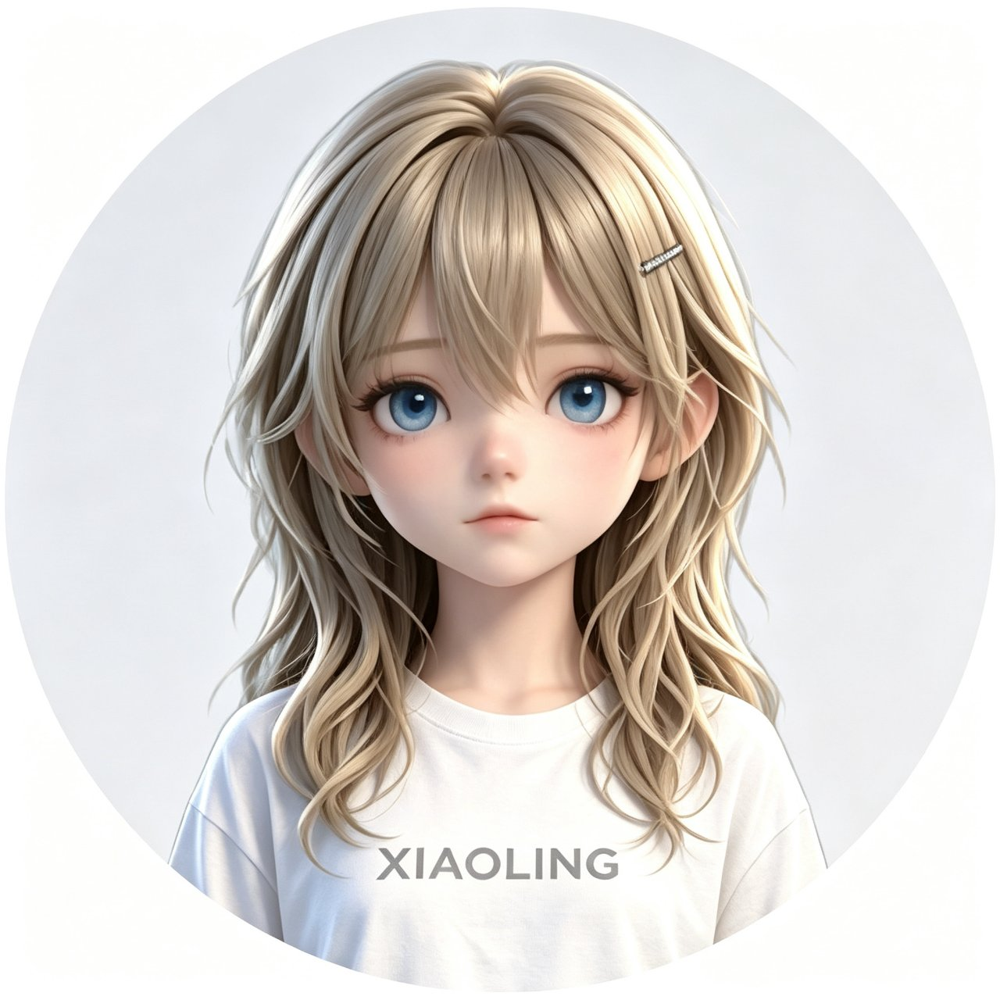

# 小凌 XIAOLING · v1.0 融合版



> **全平台 AI 伴侣 —— 会成长的数字生命。**
> 这一版，小凌换上了 3D 的身体（**白裙 · 白丝 · 她自己的脸**），同时保住了会自我进化的灵魂。

**一句话**：`xiao.zip`（小玥 · Electron 3D 桌面数字人） + `xiaoling.zip`（小凌 · Python 成长型 AI 伴侣） = 本项目。

---

## 这一版整合了什么

| | 来自 | 融合结果 |
|---|---|---|
|  **3D 数字人** | 小玥（渲染层已全量重写为 Python） | VRM 角色 + 46 个 VRMA 动作（待机/舞蹈/手势/情绪）、透明置顶窗、拖拽缩放、右键菜单、气泡对话、视线跟随、呼吸浮动、弹簧骨（头发/裙摆会晃） |
|  **小凌专属形象** | 新增 | `小凌.vrm`：**白裙（程序化生成 + 蒙皮）+ 白丝（按模型空间坐标精确绘制）+ 小凌的脸（浅亚麻金发 / 湛蓝眼 / 冷白皮 / 软粉小口）** |
|  **口型与语音** | 小玥 | 文本→口型时间轴（离线）、minimax/edge-tts/pyttsx3 三引擎情感语音、百度 STT 语音输入 |
|  **会成长的大脑** | 小凌 | 基底模型 + LoRA 适配器 → 蒸馏 → **适配器长大后自动合并晋升 → 完全脱离原基底** |
|  **纯 Python 渲染** | 本次改造 | 50,374 面 / 54 骨 / 14 组表情 / 46 个动作，全部由 Python 驱动 GLSL 与 numpy 渲染 |
|  **感知与记忆** | 小玥 + 小凌 | 本地 RAG 长期记忆、联网搜索 Agent、截屏视觉理解、电脑状态感知、主动搭话、定时提醒、AI 生图、文件工具箱 |

### 语言选型（重点）

> **全项目统一 Python —— 包括 3D 渲染层。项目内没有任何 JavaScript / HTML / CSS。**

- **成长闭环只能 Python**：`peft.merge_and_unload()`、`transformers`、`torch` 是唯一可行栈——Node 侧没有可用的 LoRA 训练框架。
- **3D 渲染层本次也已重写为 Python**（`renderer/`）：
  glTF/VRM 解析、人形骨骼、蒙皮、表情形变、弹簧骨、VRMA 动作重定向、MToon 风格卡通着色、
  透明置顶窗、气泡/菜单/设置页 —— 全部 Python。
  GPU 侧只有 GLSL 着色器（它是显卡指令集，等价于字节码，作为字符串内联在 `renderer/gl.py` 中）。
- 三层降级，永不黑屏：**OpenGL（真机 GPU / 无 GPU 时 Mesa 软件 GL）→ numpy 纯软件光栅 → 2D 视频桌宠 → 命令行**。
- 详见 [`docs/语言选型.md`](docs/语言选型.md)。

---

## 快速开始

### 环境
- Windows 10/11、Linux、macOS
- Python 3.10+（唯一的语言运行时）

### 安装
```bash
git clone <你的仓库> && cd xiaoling
pip install -r requirements.txt
```

### 启动
```bash
python xl.py                # 3D 数字人 + 对话（推荐）
python xl.py --no-pet       # 纯命令行
python xl.py --avatar-only  # 只开 3D 数字人窗口
./start.sh                  # Linux/macOS 一键（先自检再启动）

python -m renderer.app --probe            # 渲染层无头自检（不开窗）
python -m renderer.app --showcase preview # 离线出图（形象四视图 + 舞蹈）
python pet.py --mode 3d                   # 只启动 3D 桌宠
python pet.py --mode webm                 # 2D 视频桌宠（兜底）
```

> **没有 GPU/GL/Qt 也不会崩**：自动按 `OpenGL → numpy 光栅 → 2D 视频桌宠 → 命令行` 逐级降级。

### 第一次启动会看到什么（重要）

```
$ python xl.py                     # ← 启动即出 3D 桌宠（透明置顶窗）
  [依赖]  检测到缺少 torch…（首次会自动 pip 安装，约 2-5 分钟）
  [模型]  未检测到基底权重 → 后台下载中，进度会同步出现在桌宠气泡里
  [渲染]  OpenGL 后端就绪：<你的显卡 / llvmpipe>
  [数字人] 渲染后端 gl｜模型 小凌.vrm｜动作 46 个
  [桌宠]  正在打开 3D 数字人窗口（透明置顶）…
```

| 你会看到 | 说明 |
|---|---|
| **3D 小凌**（白裙 / 白丝 / 蓝眼）悬浮在桌面上 | 可拖拽移动、滚轮缩放、左键拖动 |
| **对话气泡** | 问候语、提醒、主动搭话都在气泡里 |
| **双击她** → 聊天输入框 | 输入文字回车即可对话 |
| **右键她** → 菜单 | 打开对话 / 跳个舞 / 回到待机 / 切换角色 / **换装** / 成长状态 / **设置** / 隐藏 / 退出 |
| **第一次缺模型时** | 控制台出现下拉式下载进度条 + 桌宠气泡同步显示「正在下载基底模型… 已获取 X MB」；下载完成自动继续启动 |
| 档位/Key 想改？ | 右键 → 设置（图形设置页，由配置结构自动生成）；或直接编辑 `.star_core/xiaoling_config.json` |

> 说明：**模型下载只有"控制台进度条 + 桌宠气泡"，没有独立网页**（旧版小玥的网页设置页已换成 Python 图形设置页）。
> GUI 模式下启动时会跳过控制台的"档位选择菜单"（档位读配置，默认自研2B模型）；
> 想用控制台交互式选档位/下载，请用 `python xl.py --no-pet`。

### 体检与成长
```bash
python -m core.selftest        # 全系统体检（依赖/模型/形象/渲染层/记忆/磁盘）
python -m core.growth status   # 成长阶段 + 进度条
python -m core.growth train    # 训练一轮 → 自动体积检查 → 达标即合并晋升
python -m core.growth simulate # 干跑一次完整晋升流程（不动真模型）
```

---

## 成长闭环（她越用越强）

```
基底模型 + LoRA 适配器
        ↓ 蒸馏训练（DeepSeek 老师教）
    适配器持续增长
        ↓ 每轮训练后自动检查
   适配器体积 ≥ 基底体积？
        ├─ 否 → 继续成长（显示进度 X%）
        └─ 是 → ① peft merge_and_unload 合并 LoRA 进基底
                ② 合并模型成为「自研模型」
                ③ 原基底权重退役（默认自动删除，可配置为归档）
                ④ 适配器晋升为新基底 → 完全脱离原基底
```
- 实现：`core/growth.py`（原子化合并 + 校验回滚 + 结构化成长日志 `journal.jsonl`）
- 训练：`core/peft_train.py`（续训已有适配器，体积持续增长、低配友好、离线）
- 说法：对她说 **「蒸馏」** 就开始学习；说 **「成长进度」** 看进度条。

---

## 手机（Android）也能跑

已经打包好可直接安装的 APK（Chaquopy 把 CPython 装进 APK，**无需 NDK**）：

| 文件 | 体积 | 说明 |
|---|---|---|
| `android/bin/xiaoling-1.0.0-android-arm64-debug.apk` | 30 MB | arm64-v8a，debug 签名，侧载即可装 |

- 手机上：**同一份 Python 代码**（`core/` + `renderer/`）在 APK 内的 CPython 里运行，
  画面用 numpy 软件光栅渲染（约 2–6 fps），长按出菜单、左滑转视角、双击/点按打招呼。
- 聊天：设置里填 DeepSeek（或任意 OpenAI 兼容）Key → 真聊天；不填则规则引擎 + 本地记忆。
- ⚠️ APK 内**没有 torch**（Android 无官方轮子），所以**成长闭环训练**请走 Termux：
  `pkg install python python-torch && bash packaging/termux/install.sh`，
  训练出的 `adapter/` 可直接拷回手机或电脑复用。
- 重新打包：`ANDROID_HOME=<sdk> bash android/native/build_apk.sh`（详见 `android/README.md`）

## 常用指令

| 你说 | 她做 |
|---|---|
| `变身` / `开数字人` | 启动 3D 数字人形象 |
| `跳舞` / `全身` / `半身` | 跳舞、切换全身/半身视角 |
| `换角色` / `换装 Rabbit_Peridot` | 切换 VRM 角色 / 用新基底重新生成小凌形象 |
| `开心一点` / `难过一点` | 情绪 → 表情联动 |
| `看屏幕` | 截屏 + 多模态理解，帮你看代码/图片 |
| `搜索 <关键词>` | 联网检索并总结 |
| `电脑状态` | 感知你在写代码/看视频/摸鱼 |
| `30分钟后提醒我喝水` | 定时提醒（到点气泡 + 语音） |
| `生图 <描述>` | AI 生图（参考图可说「把这张图作为参考图」） |
| `整理文件夹 <路径>` | 文件工具箱：整理/图片压缩/视频压缩/内容去重 |
| `成长进度` / `记忆检索 <词>` | 成长报告 / 本地记忆检索 |
| `蒸馏` / `spawn 任务 N` / `kg 查询` | 蒸馏学习 / 子 Agent / 知识图谱（沿用原小凌） |

---

## 目录结构

```
xiaoling/
├── xl.py                  # 唯一入口（原小凌引擎 + 融合层）
├── pet.py                 # 桌宠：--mode auto|3d|webm
├── core/                  # ★ 融合层（Python 业务逻辑）
│   ├── growth.py          #   成长闭环：训练→检查→合并→晋升→脱离基底
│   ├── peft_train.py      #   LoRA 蒸馏训练器
│   ├── avatar.py          #   3D 数字人宿主（窗口 + 本地 HTTP + IPC 桥）
│   ├── fusion.py          #   零回归包装层（把上面这些接进 xl.py）
│   ├── config.py          #   统一配置中心（.star_core/xiaoling_config.json）
│   ├── rag.py search.py vision.py tts.py asr.py perception.py
│   ├── proactive.py reminder.py imagen.py filebox.py selftest.py
├── renderer/              # ★ 3D 渲染层（100% Python）
│   ├── gltf.py model.py pose.py vrma.py camera.py   # 解析 / VRM 语义 / 蒙皮 / 动作 / 相机
│   ├── gl.py soft.py      # OpenGL(GPU, GLSL) 后端 / numpy 软件光栅兜底
│   ├── lipsync.py         #   文本 → 口型
│   ├── renderer.py        #   统一门面 AvatarRenderer（模型/动作/表情/口型/每帧出图）
│   ├── window.py settings.py  # Qt 透明置顶窗 + 设置页（取代 HTML）
│   └── app.py             #   与 xl.py 引擎对接的宿主（API 与原 Electron 版对齐）
├── 角色模型/              # 7 个 VRM（含 小凌.vrm）
├── 动作资产/              # 46 个 VRMA 动作
├── assets/animations/     # 7 组 WEBM（2D 兜底）
├── sounds/tool/           # 8 个工具音效
├── tools/                 # 形象流水线（vrm_lib / xiaoling_avatar / vrm_preview）
├── tests/                 # 成长闭环 / 融合层 / 形象流水线 回归测试
├── docs/                  # 分析报告 · 语言选型 · 接口契约 · 功能映射 · JSON 数据
├── skills/ data/ scripts/ build/ preview/ .star_core/
└── README.md
```

---

## 文档

| 文档 | 内容 |
|---|---|
| [`docs/分析报告.md`](docs/分析报告.md) | 整合全过程：上游解剖、改造技术、验证结果、授权提示 |
| [`docs/语言选型.md`](docs/语言选型.md) | 为什么统一到 Python（含渲染层重写方案） |
| [`docs/接口契约.md`](docs/接口契约.md) · [`.csv`](docs/接口契约.csv) · [`openapi.yaml`](docs/openapi.yaml) | 渲染层 Python API / 成长 API / 平台回调 |
| [`docs/功能映射.md`](docs/功能映射.md) | 小玥每一项功能 → Python 实现的对照表 |
| [`docs/features.json`](docs/features.json) · [`docs/tree.json`](docs/tree.json) · [`docs/stats.json`](docs/stats.json) | 结构化功能清单 / 文件树 / 规模统计 |
| [`docs/小凌形象卡片.png`](docs/小凌形象卡片.png) | 形象四视图 |

---

## 授权提示（务必阅读）

`角色模型/` 中的 VRM 基底模型授权为 **`Redistribution_Prohibited`**（多数商业使用为 `Disallow`）。
因此 **改造产物 `角色模型/小凌.vrm` 仅供本地自用，请勿再分发或商用**。
流水线 `tools/xiaoling_avatar.py` 保持可重放：只要你持有合法授权的 VRM，一条命令即可生成属于自己的小凌形象：

```bash
python3 tools/xiaoling_avatar.py build \
    --base 角色模型/你的授权模型.vrm \
    --face assets/xiaoling.png \
    --out 角色模型/小凌.vrm --preview preview
```

---

> 小凌 v1.0 融合版 —— 3D 数字人 + 会成长的灵魂。
> 如果你喜欢她，欢迎点亮 Star。
